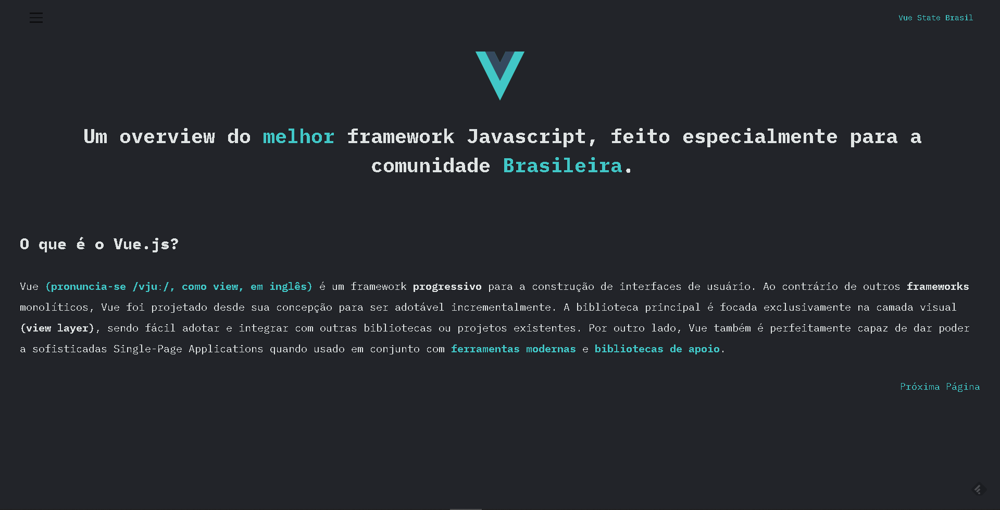

<h1 align="center">Vue State Brasil</h1>

# Introdução

 O objetivo da Vue State Brasil é simplesmente colocar o Vue nos holofotes. Esse será um espaço para reunirmos informações de diversas fontes, afim de sanar dúvidas das pessoas e empresas em relação ao uso do Vue.

 # O que é o Vue?

Vue (pronuncia-se /vjuː/, como view, em inglês) é um framework progressivo para a construção de interfaces de usuário. Ao contrário de outros frameworks monolíticos, Vue foi projetado desde sua concepção para ser adotável incrementalmente. A biblioteca principal é focada exclusivamente na camada visual (view layer), sendo fácil adotar e integrar com outras bibliotecas ou projetos existentes. Por outro lado, Vue também é perfeitamente capaz de dar poder a sofisticadas Single-Page Applications quando usado em conjunto com ferramentas modernas e bibliotecas de apoio.

# Features

Esta aplicação possui todas as ferramentas e práticas mais recentes em desenvolvimento web!

- **Vue.js** — The Progressive JavaScript Framework
- **Vuesax** — Vuesax Frontend Vue Components
- **Apexcharts** — Modern & Interactive Open-source Charts
- **Tailwind** — A utility-first CSS framework for
rapidly building custom designs.

# Open Source

Esse projeto é open source, então fique a vontade para contribuir com issues e pull requests.

 

Made with Vue and Tailwind

